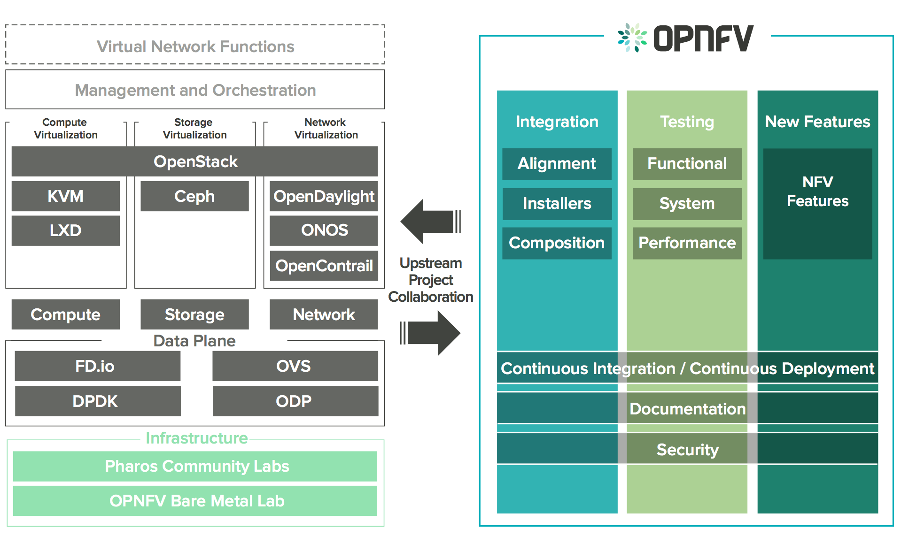
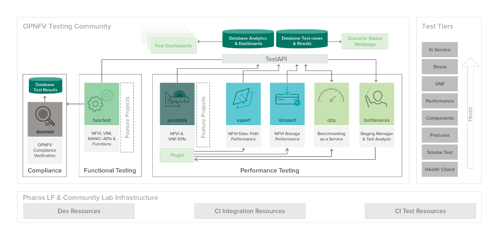

.. _opnfv-overview:

.. This work is licensed under a Creative Commons Attribution 4.0 International License.
.. SPDX-License-Identifier: CC-BY-4.0
.. (c) Open Platform for NFV Project, Inc. and its contributors

=============
OPNFV 概述
=============

绪论
=====

网络功能虚拟化（NFV）正在通过软件定义的基础架构改变网络行业，开源是快速开发可以推向市场的商业产品和服务软件的方法。
NFP开放平台（OPNVF）有助于各种开源生态系统的NFV组件的开发和演进。
通过系统集成，部署和测试，OPNFV具有独特的优势，将标准机构，开源社区，服务提供商和商业供应商的工作聚集在一起，
为行业提供一个事实上的NFV平台。

通过集成来自上游项目的组件，社区能够对各种解决方案进行性能和用例检测，以确保平台适用于NFV使用案例。
OPNFV还与其他开源社区一起工作，以蓝图、补丁、bug及新代码的形式将贡献和学习代入这些社区。

OPNFV最初专注于通过集成来自 OpenDaylight，OpenStack，Ceph Storage，KVM，OpenvSwitch 和 Linux等上游项目的组件来构建NFV基础设施（NFVI）和虚拟化基础架构管理（VIM）。
最近，OPNFV扩展了其转发解决方案组合，包括fd.io和ODP，能够在英特尔和ARM商业和白盒硬件上运行，支持VM，Container和BareMetal工作负载，
还包括管理和网络管理编排MANO组件主要用于Danube版本中的应用组合和管理。

这些功能以及与其他NFV元件的应用程序可编程接口（API）构成了虚拟网络功能（VNF）和MANO组件所需的基本架构。

重点关注这些组件，同时考虑关于附加主题的拟议项目（如MANO组件和应用程序本身），
OPNFV旨在通过提高性能和功率效率来提高可靠性，可用性和可服务性，并提供全面的平台仪器来加强NFV服务。

OPNFV 平台架构
================

The OPNFV project addresses a number of aspects in the development of a consistent virtualisation
platform including common hardware requirements, software architecture, MANO and applications.

OPNFV Platform Overview Diagram

To address these areas effectively, the OPNFV platform architecture can be decomposed
into the following basic building blocks:

* Hardware: with the Infra working group, Pharos project and associated activities
* Software Platform: through the platform integration and deployment projects
* MANO: through the MANO working group and associated projects
* Applications: which affect all other areas and drive requirements for OPNFV

OPNFV 实验室基础设施
======================

The infrastructure working group oversees such topics as lab management, workflow,
definitions, metrics and tools for OPNFV infrastructure.

Fundamental to the WG is the
`Pharos Specification <https://wiki.opnfv.org/display/pharos/Pharos+Specification>`_
which provides a set of defined lab infrastructures over a geographically and technically
diverse federated global OPNFV lab.

Labs may instantiate bare-metal and virtual environments that are accessed remotely by the
community and used for OPNFV platform and feature development, build, deploy and testing.
No two labs are the same and the heterogeneity of the Pharos environment provides the ideal
platform for establishing hardware and software abstractions providing well understood
performance characteristics.

Community labs are hosted by OPNFV member companies on a voluntary basis.
The Linux Foundation also hosts an OPNFV lab that provides centralized CI
and other production resources which are linked to community labs.
Future lab capabilities will include the ability easily automate deploy and test of any
OPNFV install scenario in any lab environment as well as on a nested "lab as a service"
virtual infrastructure.

OPNFV 软件平台架构
====================

The OPNFV software platform is comprised exclusively of open source implementations of
platform component pieces.  OPNFV is able to draw from the rich ecosystem of NFV related
technologies available in open-source then integrate, test, measure and improve these
components in conjunction with our source communities.

While the composition of the OPNFV software platform is highly complex and constituted of many
projects and components, a subset of these projects gain the most attention from the OPNFV community
to drive the development of new technologies and capabilities.

----------------------
虚拟基础设施管理
----------------------

OPNFV derives it's virtual infrastructure management from one of our largest upstream ecosystems
OpenStack.  OpenStack provides a complete reference cloud management system and associated technologies.
While the OpenStack community sustains a broad set of projects, not all technologies are relevant in
an NFV domain, the OPNFV community consumes a sub-set of OpenStack projects where the usage and
composition may vary depending on the installer and scenario.

For details on the scenarios available in OPNFV and the specific composition of components
refer to the :ref:`OPNFV User Guide & Configuration Guide <opnfv-user-config>`

------------
操作系统
------------

OPNFV currently uses Linux on all target machines, this can include Ubuntu, Centos or SUSE linux. The
specific version of Linux used for any deployment is documented in the installation guide.

------------
网络技术
------------

SDN 控制器
------------

OPNFV, as an NFV focused project, has a significant investment on networking technologies
and provides a broad variety of integrated open source reference solutions.  The diversity
of controllers able to be used in OPNFV is supported by a similarly diverse set of
forwarding technologies.

There are many SDN controllers available today relevant to virtual environments
where the OPNFV community supports and contributes to a number of these.  The controllers
being worked on by the community during this release of OPNFV include:

* Neutron: an OpenStack project to provide “network connectivity as a service” between
  interface devices (e.g., vNICs) managed by other OpenStack services (e.g., nova).
* OpenDaylight: addresses multivendor, traditional and greenfield networks, establishing the
  industry’s de facto SDN platform and providing the foundation for networks of the future.
* ONOS: a carrier-grade SDN network operating system designed for high availability,
  performance, scale-out.

.. OpenContrail SDN controller is planned to be supported in the next release.

数据面
---------

OPNFV extends Linux virtual networking capabilities by using virtual switching
and routing components. The OPNFV community proactively engages with these source
communities to address performance, scale and resiliency needs apparent in carrier
networks.

* FD.io (Fast data - Input/Output): a collection of several projects and libraries to
  amplify the transformation that began with Data Plane Development Kit (DPDK) to support
  flexible, programmable and composable services on a generic hardware platform.
* Open vSwitch: a production quality, multilayer virtual switch designed to enable
  massive network automation through programmatic extension, while still supporting standard
  management interfaces and protocols.

部署架构
==========

A typical OPNFV deployment starts with three controller nodes running in a high availability
configuration including control plane components from OpenStack, SDN, etc. and a minimum
of two compute nodes for deployment of workloads (VNFs).
A detailed description of the hardware requirements required to support the 5 node configuration
can be found in pharos specification: `Pharos Project <https://www.opnfv.org/developers/pharos>`_

In addition to the deployment on a highly available physical infrastructure, OPNFV can be
deployed for development and lab purposes in a virtual environment.  In this case each of the hosts
is provided by a virtual machine and allows control and workload placement using nested virtualization.

The initial deployment is done using a staging server, referred to as the "jumphost".
This server-either physical or virtual-is first installed with the installation program
that then installs OpenStack and other components on the controller nodes and compute nodes.
See the :ref:`OPNFV User Guide & Configuration Guide <opnfv-user-config>` for more details.

OPNFV 测试生态系统
====================

The OPNFV community has set out to address the needs of virtualization in the carrier
network and as such platform validation and measurements are a cornerstone to the
iterative releases and objectives.

To simplify the complex task of feature, component and platform validation and characterization
the testing community has established a fully automated method for addressing all key areas of
platform validation. This required the integration of a variety of testing frameworks in our CI
systems, real time and automated analysis of results, storage and publication of key facts for
each run as shown in the following diagram.

发布验证
===========

The OPNFV community relies on its testing community to establish release criteria for each OPNFV
release. Each release cycle the testing criteria become more stringent and better representative
of our feature and resiliency requirements.

As each OPNFV release establishes a set of deployment scenarios to validate, the testing
infrastructure and test suites need to accommodate these features and capabilities. It’s not
only in the validation of the scenarios themselves where complexity increases, there are test
cases that require multiple datacenters to execute when evaluating features, including multisite
and distributed datacenter solutions.

The release criteria as established by the testing teams include passing a set of test cases
derived from the functional testing project ‘functest,’ a set of test cases derived from our
platform system and performance test project ‘yardstick,’ and a selection of test cases for
feature capabilities derived from other test projects such as bottlenecks, vsperf, cperf and
storperf. The scenario needs to be able to be deployed, pass these tests, and be removed from
the infrastructure iteratively (no less that 4 times) in order to fulfil the release criteria.

--------
Functest
--------

Functest provides a functional testing framework incorporating a number of test suites
and test cases that test and verify OPNFV platform functionality.
The scope of Functest and relevant test cases can be found in the :ref:`Functest User Guide <functest-userguide>`

Functest provides both feature project and component test suite integration, leveraging
OpenStack and SDN controllers testing frameworks to verify the key components of the OPNFV
platform are running successfully.

---------
Yardstick
---------

Yardstick is a testing project for verifying the infrastructure compliance when running VNF applications.
Yardstick benchmarks a number of characteristics and performance vectors on the infrastructure making it
a valuable pre-deployment NFVI testing tools.

Yardstick provides a flexible testing framework for launching other OPNFV testing projects.

There are two types of test cases in Yardstick:

* Yardstick generic test cases and OPNFV feature test cases;
  including basic characteristics benchmarking in compute/storage/network area.
* OPNFV feature test cases include basic telecom feature testing from OPNFV projects;
  for example nfv-kvm, sfc, ipv6, Parser, Availability and SDN VPN

系统评估和合格测试
======================

The OPNFV community is developing a set of test suites intended to evaluate a set of reference
behaviors and capabilities for NFV systems developed externally from the OPNFV ecosystem to
evaluate and measure their ability to provide the features and capabilities developed in the
OPNFV ecosystem.

The Dovetail project will provide a test framework and methodology able to be used on any NFV platform,
including an agreed set of test cases establishing an evaluation criteria for exercising
an OPNFV compatible system. The Dovetail project has begun establishing the test framework
and will provide a preliminary methodology for the Danube release. Work will continue to
develop these test cases to establish a stand alone compliance evaluation solution
in future releases.

附加测试
==========

Besides the test suites and cases for release verification, additional testing is performed to validate
specific features or characteristics of the OPNFV platform.
These testing framework and test cases may include some specific needs; such as extended measurements,
additional testing stimuli, or tests simulating environmental disturbances or failures.

These additional testing activities provide a more complete evaluation of the OPNFV platform.
Some of the projects focused on these testing areas include:

------
VSPERF
------

VSPERF provides an automated test-framework and comprehensive test suite for measuring data-plane
performance of the NFVI including switching technology, physical and virtual network interfaces.
The provided test cases with network topologies can be customized while also allowing individual
versions of Operating System, vSwitch and hypervisor to be specified.

--------
瓶颈
--------

Bottlenecks provides a framework to find system limitations and bottlenecks, providing
root cause isolation capabilities to facilitate system evaluation.

.. _`OPNFV Configuration Guide`: `OPNFV User Guide & Configuration Guide`
.. _`OPNFV User Guide`: `OPNFV User Guide & Configuration Guide`
.. _`Dovetail project`: https://wiki.opnfv.org/display/dovetail
